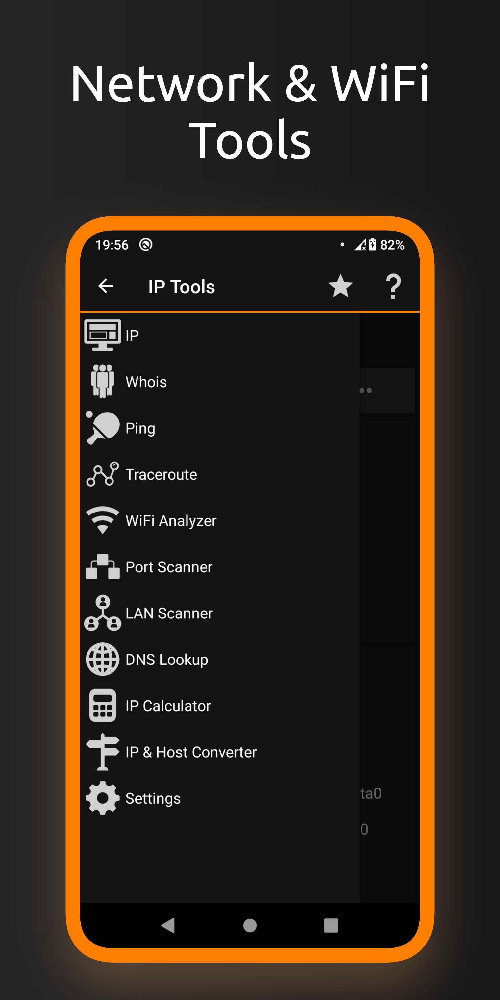
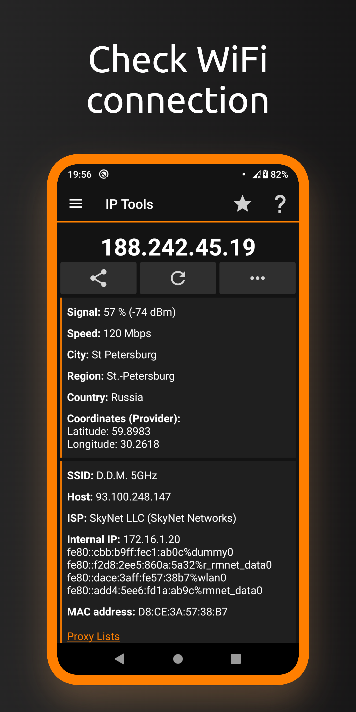
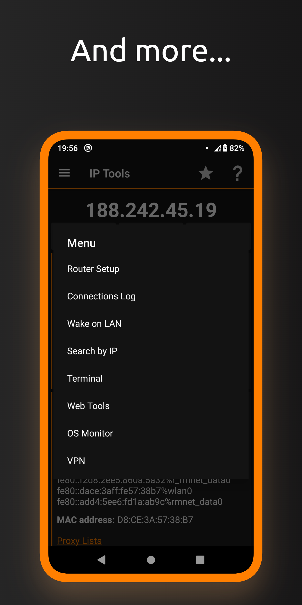

# IP Tools
 

Powerful tool for check, analyze and setup networks. Helps to quickly detecting any computer net problems, ip address and help to improve wifi and mobile connection performance.

Download ip tools apk

## Features
* Ping
* Whois
* Traceroute
* DNS Lookup
* Port Scanner
* IP Calculator
* Connection Log
* Router Setup tool
* IP & Host Converter
* WiFi Analyzer & LAN Scanner
* Network statistics
* And more...

## Screenshots
<table>
  <tr>
    <td></td>
    <td></td>
    <td></td>
	</tr>
</table>

## Telegram Bot
Bot for Telegram messenger available [here](https://t.me/ip_tools_bot).

Our Telegram community: https://t.me/ip_tools.

## Compatibility
Latest version supports Android 8.0+ (Android APi 26+) and [legacy](https://github.com/IP-Tools-App/ip-tools-apk/releases/tag/8.70) version for Android 5.0+ (Android API 21+). All architectures.

## Feedback 
* Bug reports can be submitted [here](https://github.com/IP-Tools-App/ip-tools-apk/issues).
* Any ideas can be submitted [here](https://github.com//IP-Tools-App/ip-tools-apk/discussions).

## FAQ
N/A

## EULA & Privacy Policy
By downloading or opening the application, you accept the [user agreement and privacy policy](https://ip-tools.app/eula). 
You may not: copy, modify, translate or create derivative works based on the  IP Tools ("Software"); distribute, transfer, publish, disclose, sublicense, lease, lend, sell or rent the Software to any third party; reverse engineer, decompile, reverse decompile or disassemble the Software, or otherwise attempt to derive the source code; make the functionality of the Software available to third parties or multiple users through any means, or benchmark or conduct any performance or comparison tests on the Software. IP Tools Network Utilities reserves all rights in and to the Software not expressly granted to you under EULA.
